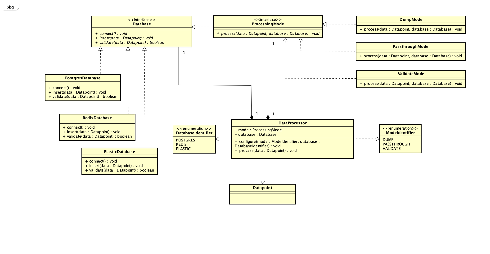

# Task 2: Software Architecture

My solution for Task 2 of the Walmart Advanced Software Engineering Job Simulation on Forage.

The task was to design a dynamically reconfigurable data processor. The processor must support multiple operating modes and database implementations while allowing both to change at runtime.

## Class Diagram



[View the UML class diagram as a PDF](<Dynamically Reconfigurable Data Processor.pdf>)

## Architecture Overview

The design separates processing behavior from database behavior using two independently replaceable strategies.

### DataProcessor

`DataProcessor` coordinates the system. It maintains:

- One current `ProcessingMode`
- One current `Database`

Its public operations are:

- `configure(mode: ModeIdentifier, database: DatabaseIdentifier): void`
- `process(data: Datapoint): void`

`configure` selects the requested mode and database strategies and connects the selected database. Calling it again allows either strategy to change at runtime.

When `process` receives a `Datapoint`, it delegates processing to the current mode and provides the currently configured database.

### Processing Modes

The `ProcessingMode` interface defines a common operation:

```text
process(data: Datapoint, database: Database): void
```

It has three implementations:

- `DumpMode` discards the incoming data.
- `PassthroughMode` inserts the data directly into the configured database.
- `ValidateMode` validates the data against the configured database and inserts it only when validation succeeds.

Because the modes depend on the `Database` interface, they do not need to know whether the active implementation is Postgres, Redis, or Elastic.

### Databases

The `Database` interface defines the required high-level operations:

```text
connect(): void
insert(data: Datapoint): void
validate(data: Datapoint): boolean
```

It has three implementations:

- `PostgresDatabase`
- `RedisDatabase`
- `ElasticDatabase`

Each implementation is responsible for providing its own database-specific behavior. The architecture intentionally leaves out connection strings, SQL, validation algorithms, and other implementation details.

## UML Relationships

### Composition

`DataProcessor` has composition relationships with `ProcessingMode` and `Database`.

In the diagram, composition is represented by a solid line with a filled diamond at the `DataProcessor` end. This shows that the processor maintains its current mode and database strategies.

The multiplicity of `1` indicates that one mode and one database are active at a time.

### Interface Realization

The concrete modes realize the `ProcessingMode` interface, and the concrete databases realize the `Database` interface.

Interface realization is represented by a dashed line with a hollow triangle pointing toward the interface. It means that each concrete class implements the contract defined by its interface.

### Dependency

`ProcessingMode` has a dependency on `Database`.

A dependency is represented by a dashed line with an open arrowhead pointing toward the type being used. This relationship is important because modes use the abstract `Database` interface rather than depending directly on Postgres, Redis, or Elastic.

`DataProcessor` also depends on `ModeIdentifier`, `DatabaseIdentifier`, and `Datapoint` through its method parameters.

There are intentionally no direct relationships between individual modes and concrete databases. Adding those relationships would tightly couple the two strategy families and could lead to a separate class for every mode/database combination.

## Design Principles

### Strategy Pattern

The processing modes and databases are modeled as strategies that can be replaced at runtime. This allows the processor to change behavior without changing its public interface.

### Single Responsibility Principle

Each type has one main responsibility:

- `DataProcessor` coordinates configuration and processing.
- Mode classes define how data is handled.
- Database classes define how data is stored and validated.

### Open/Closed Principle

New modes or database implementations can be added by implementing the appropriate interface. Existing strategy classes do not need to be rewritten.

The identifier-to-strategy selection inside `configure` would still need to be updated when a new option is introduced.

### Dependency Inversion Principle

The processing modes depend on the high-level `Database` abstraction rather than concrete database classes. This keeps operating modes independent from database-specific behavior.

## Comparison With the Example Solution

I compared my design with the provided example only after completing my own attempt.

The example solution uses a factory to create modes and gives certain modes ownership of a database connector. My design instead keeps the current mode and database as two separate strategies owned by `DataProcessor`.

Both approaches avoid creating a separate class for every mode/database combination. My approach more directly emphasizes that the mode and database can be selected independently. A factory could centralize configuration later if the number of strategies became large, but it was not necessary for the current requirements.

## Reflection

I learned that the Strategy pattern can separate behaviors that change independently. Instead of creating classes such as a Postgres validation mode, Redis validation mode, and Elastic validation mode, one validation strategy can work with any implementation of the `Database` interface.

The strongest part of my design is the separation between processing modes and database implementations. This keeps the class hierarchy small, supports runtime reconfiguration, and follows Dependency Inversion.

One possible improvement would be to move strategy selection into a factory or registry if the number of modes and databases grew significantly. For the current requirements, keeping that selection inside `configure` provides a simpler design with fewer abstractions.